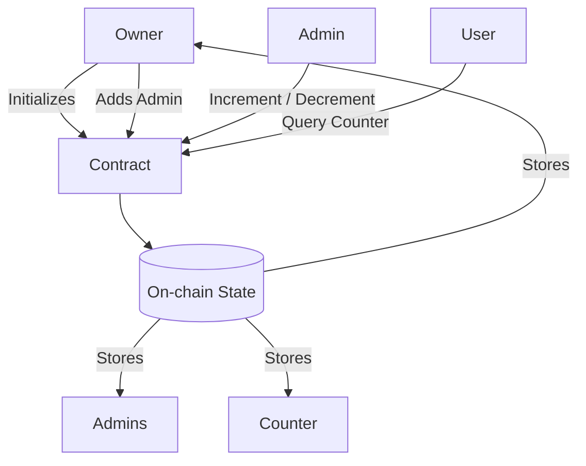
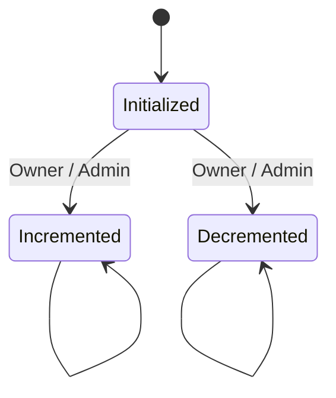

# Counter With Roles – Rust Smart Contract

## Contract Summary

This project is a beginner-friendly Rust smart contract that implements an on-chain counter with role-based access control.

The contract allows:
- An owner to initialize the contract
- The owner to assign admin roles
- Only the owner or admins to increment or decrement a counter
- Anyone to query the current counter value

The goal of this project is to demonstrate core smart contract fundamentals such as state initialization, controlled state mutation, access control, error handling, and basic security considerations using idiomatic Rust.

---

## Why This Design Was Chosen

This design was chosen because it clearly demonstrates how permissions and roles work in real-world smart contracts. Many production contracts restrict who can update shared state, and this counter models that pattern in a simple, easy-to-understand way suitable for beginners.

---

## Contract Architecture



## State & Flows

### Stored State
- owner: Address of the contract owner
- admins: List of addresses with permission to modify the counter
- count: Current counter value

### State Initialization
- The contract is initialized by the owner
- Counter value is set to 0
- Admin list starts empty

### Important Transactions

**Increment Counter**
- Caller must be owner or admin
- Counter value increases by 1

**Decrement Counter**
- Caller must be owner or admin
- Counter value decreases by 1

**Add Admin**
- Only the owner can add new admins

---

## State Flow Diagram



## Security Checks Implemented

- Role-based access control for all state mutations
- Authorization checks before updating state
- Explicit error handling for unauthorized access
- Safe state updates only after validations pass

---

## How to Build & Test

Deployment is not required for this submission.

```bash
cargo build
cargo test
```

## Known Limitations

- Contract is not deployed
- No unit or integration tests included
- Admins cannot be removed once added
- No counter upper or lower bounds

---

## Possible Improvements

- Add comprehensive unit tests
- Support admin removal
- Add bounds checking for counter
- Emit events for state changes

---

## Deployed Link

Not deployed.  
This submission focuses on learning fundamentals, clarity, and correctness rather than live deployment.

---

## Author

Saumya Raj  
Build & Learn Week – Web3 101

